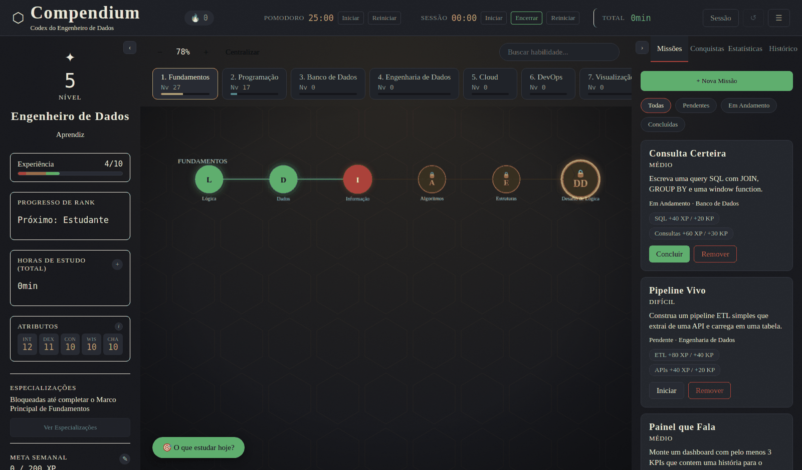
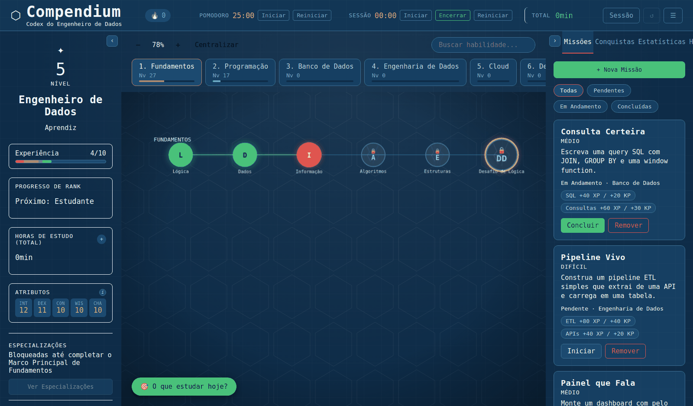

# ✦ Compendium: Codex do Engenheiro de Dados

Uma árvore de habilidades estilo RPG pra gamificar o estudo contínuo da trilha de **Engenharia de Dados** — 100% local, sem conta, sem backend, sem instalar nada além de um navegador.

<p align="center">
  
</p>

<details>
<summary>Ver no tema claro (Blueprint)</summary>
<p align="center">
  
</p>
</details>

---

## O que é

Cada habilidade da trilha — de lógica de programação a arquitetura de pipelines — é um nó numa árvore, com XP e progresso próprios. Em vez de uma lista de tópicos pra marcar como "concluído", o Compendium trata isso como um jogo de verdade: nível, rank, conquistas, streak, especializações. A ideia é simples — **estudar deveria dar vontade de voltar no dia seguinte.**

## Funcionalidades

**Sistema de progressão**
- 8 categorias (Fundamentos, Programação, Banco de Dados, Engenharia de Dados, Cloud, DevOps, Visualização, Soft Skills), mais de 60 habilidades
- XP e KP (Conhecimento) independentes por nó — pré-requisito é sugestão, nunca bloqueio
- Rank global (Aprendiz → Estudante → Praticante → Avançado → Sênior → Mestre do Codex)
- Especializações avançadas por categoria, desbloqueadas ao masterizar o projeto principal daquela trilha
- Atributos estilo RPG (INT/DEX/CON/WIS/CHA), calculados a partir do seu progresso real

**Conteúdo de estudo**
- Recursos recomendados (documentação oficial) direto no nó
- Checklist de entrega nos projetos "Marco Principal"
- Campo de portfólio pra linkar seu repositório quando conclui um projeto
- Bloco de notas por habilidade

**Hábito e produtividade**
- Timer Pomodoro + timer de Sessão (soma num total de horas de estudo permanente)
- Streak de dias consecutivos, com indicador visual de risco
- Recomendação inteligente — botão "O que estudar hoje?" olha prazos de missão e nós esquecidos
- Resumo ao reabrir o app, notificações do navegador (opcionais), desfazer último lançamento

**Missões e conquistas**
- Missões vinculadas a habilidades específicas (inclusive recorrentes)
- Conquistas por categoria e globais, com tiers bronze/prata/ouro
- Fila de revisão — sinaliza conhecimento (KP) que está parado há mais de 7 dias

**Interface**
- Dois temas completos — Manuscrito Arcano (escuro) e Blueprint (claro) — trocáveis a qualquer momento
- Painéis retráteis, busca de habilidades, atalhos de teclado
- Instalável como app (PWA), funciona offline

## Seus dados

Tudo fica só no seu navegador (`localStorage`) — não existe servidor, conta ou telemetria. Isso também significa que o progresso é por navegador/endereço: `Exportar` e `Importar` (no menu ☰) são o jeito de levar seu progresso entre dispositivos ou versões.

## Como rodar localmente

Não precisa de instalação — é HTML/CSS/JS puro, sem build:

```bash
git clone https://github.com/SEU-USUARIO/SEU-REPOSITORIO.git
cd SEU-REPOSITORIO
python3 -m http.server 8000
```

Abra `http://localhost:8000`. Servir por HTTP (não abrir o `index.html` direto como arquivo) é necessário pra o service worker e a instalação como PWA funcionarem.

## Publicar com HTTPS (pra instalar no celular)

PWA exige um contexto seguro — `localhost` já conta, mas um IP de rede local não. O jeito mais simples e gratuito:

1. Suba os arquivos pra um repositório no GitHub
2. **Settings → Pages** → Source: branch `main`, pasta `/ (root)`
3. Espera publicar (1-2 min) e acessa a URL gerada (`seu-usuario.github.io/repositorio`) em qualquer aparelho
4. No celular: Chrome → menu → "Instalar aplicativo" · Safari (iOS) → Compartilhar → "Adicionar à Tela de Início"

## Estrutura do projeto

```
├── index.html          → Estrutura da página, carrega os outros arquivos
├── style.css            → Layout e estrutura (grid, espaçamento) — nunca cor
├── theme.css             → Tema Manuscrito Arcano (escuro) — só estética
├── theme-light.css        → Tema Blueprint (claro) — mesma estrutura, cores diferentes
├── script.js              → Toda a lógica: XP/KP, estado, missões, conquistas
├── data-embedded.js        → Dados: categorias, habilidades, missões e conquistas
├── manifest.json            → Metadados do PWA
├── service-worker.js         → Cache offline (estratégia network-first)
└── icons/                     → Ícones do app em múltiplos tamanhos
```

`style.css` e os arquivos de tema são propositalmente separados — trocar de tema visual nunca exige tocar em `script.js` ou `data-embedded.js`.

## Stack

100% vanilla — sem frameworks, sem bundler, sem dependência de build. Roda em qualquer navegador moderno abrindo um arquivo estático.

---

<p align="center"><sub>Feito pra acompanhar os próprios estudos de Engenharia de Dados — fique à vontade pra clonar e adaptar pra sua trilha.</sub></p>
