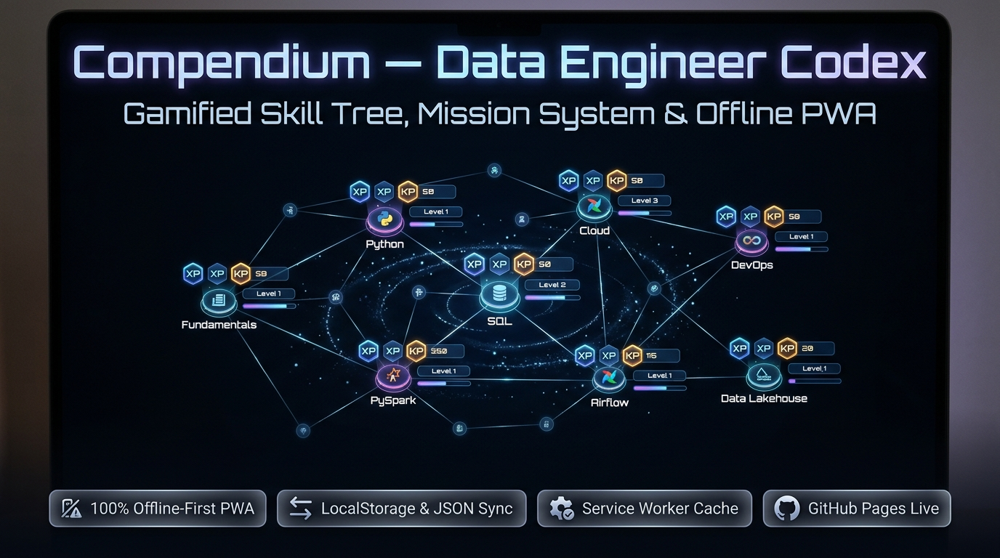

# 📜 Compendium — Codex do Engenheiro de Dados


*(Bilingual Documentation: [Português](#-português) | [English](#-english))*

---

## 🎮 Interface & Skill Tree / Visão Geral

<p align="center">
  
</p>

<p align="center">
  🌐 <b><a href="https://loweri.github.io/codexv1/">Acesse o Aplicativo PWA ao Vivo no GitHub Pages</a></b>
</p>

---

## 🇧🇷 Português

O **Compendium** é um aplicativo web progressivo (**Progressive Web App - PWA**) gamificado, desenvolvido para acompanhar, estruturar e validar a jornada de evolução contínua em **Engenharia de Dados**. Inspirado em árvores de habilidades de RPG (*Skill Trees*), o sistema transforma o aprendizado técnico em missões práticas, distribuindo pontos de experiência (**XP**) e pontos de conhecimento teórico (**KP**).

---

### ✨ Principais Recursos

- 🌐 **100% Offline-First (PWA):** Equipado com `Service Worker` e `Cache Storage API` para carregar instantaneamente e funcionar sem conexão com a internet.
- 🌳 **8 Árvores de Habilidades Especializadas:**
  1. *Fundamentos da Computação & Dados*
  2. *Programação & Python Avançado*
  3. *Banco de Dados Relacionais & SQL*
  4. *Engenharia de Dados (PySpark, Delta Lake, Airflow)*
  5. *Cloud Computing (AWS, GCP, Azure)*
  6. *DevOps & Infraestrutura (Docker, CI/CD, Linux)*
  7. *Visualização de Dados & Analytics (Streamlit, Plotly, Power BI)*
  8. *Soft Skills & Liderança Técnica*
- 🎯 **Sistema de Missões Dinâmicas:** Criação e gestão de missões com níveis de dificuldade, prazos, recorrência e vinculação direta aos nós da árvore.
- 💾 **Persistência Local & Backup:** Armazenamento seguro via `localStorage` com suporte a **Exportar/Importar JSON** para sincronização entre dispositivos.
- 🎨 **Design System Dark Mode:** Interface moderna com tema escuro imersivo, efeitos glassmorphism e microinterações responsivas.

---

### 📂 Estrutura do Projeto

```text
codexv1/
├── index.html              # Estrutura semântica principal e modais
├── style.css               # Estilização base, layout e tipografia
├── theme.css               # Design tokens para o tema escuro (Dark Theme)
├── theme-light.css         # Design tokens para o tema claro (Light Theme)
├── script.js               # Lógica da aplicação, gestão de estado e XP/KP
├── service-worker.js       # Cache de assets e suporte offline PWA
├── manifest.json           # Manifesto PWA para instalação como app nativo
├── data-embedded.js        # Dados e nós iniciais das árvores de habilidades
│
├── icons/                  # Ícones em múltiplas resoluções para o PWA
└── screenshots/            # Banners e capturas de tela do aplicativo
```

---

### 🚀 Como Usar e Instalar

1. **Acessar Online:** Abra **[https://loweri.github.io/codexv1/](https://loweri.github.io/codexv1/)** no navegador.
2. **Instalar como App:** No Google Chrome, Edge ou celular, clique no ícone **"Instalar aplicativo"** ou **"Adicionar à tela inicial"**.
3. **Backup dos Seus Dados:** Use o botão **Exportar** no rodapé para baixar o arquivo `.json` com seu progresso salvo.

---

## 🇺🇸 English

**Compendium** is an offline-first **Progressive Web App (PWA)** gamifying technical progression in **Data Engineering**. Inspired by RPG skill trees, it structures learning into actionable missions, rewarding hands-on experience (**XP**) and theoretical knowledge (**KP**).

### 🌟 Key Highlights

- **Offline-First PWA:** Service Worker caching ensures instant load times with zero network dependency.
- **8 Domain Skill Trees:** Covering Core Fundamentals, Python, SQL, Lakehouse, Cloud, DevOps, and Analytics.
- **Mission & Quest Engine:** Dynamic goal tracking linked directly to specific engineering competencies.
- **Client-Side Persistence:** LocalStorage state management with JSON backup export/import capabilities.

---

## 👨‍💻 Autor / Author

**Ericles Fernandes Oliveira** — *Data Engineer*  
GitHub: [loweri](https://github.com/loweri) | LinkedIn: [ericlesoliveira](https://www.linkedin.com/in/ericlesoliveira/)
